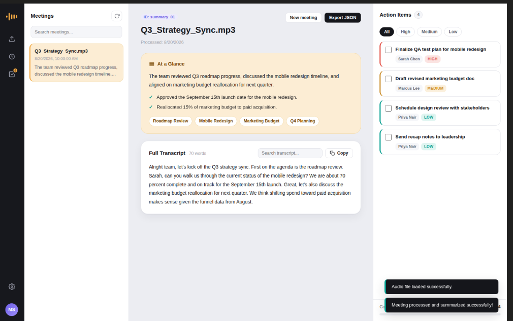
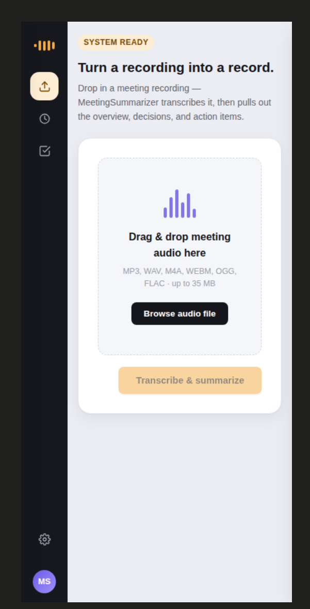
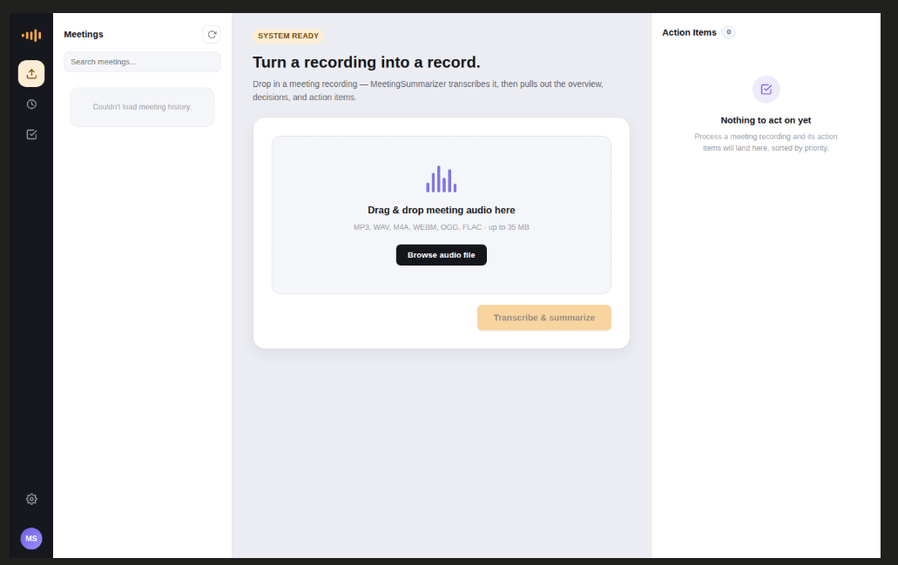

# Meeting Summarizer

A full-stack web application designed to transcribe meeting audio files and automatically generate executive summaries, key decisions, discussion topics, and action items.

The application is built with a minimal dependency approach using Python (FastAPI) for the backend and native HTML5, CSS3, and Vanilla JavaScript for the frontend. Data persistence is handled via standard JSON file storage.

## UI Screenshots







## Overview & Architecture

Meeting Summarizer accepts audio recordings in common formats (.mp3, .wav, .m4a, .webm, .ogg, .flac) up to 35 MB and processes them through an AI pipeline:

1. **Audio Ingestion & Validation:** Validates file format and size limits before saving temporarily in `temp_audio/`.
2. **Speech-to-Text (ASR):** Uses Google Gemini 1.5 Flash / 2.5 Flash (or OpenAI Whisper) to transcribe audio into text.
3. **Summarization & Task Extraction:** Generates an executive overview, highlighted key decisions, topic tags, and action items categorized by priority (High, Medium, Low) and assignee.
4. **Native Storage:** Stores results in structured JSON files under `data/summaries/` without requiring external databases.

## Project Structure

```
meeting-summarizer/
├── static/
│   ├── index.html        # Main dashboard interface
│   ├── style.css         # Workspace layout and design system
│   └── script.js         # Frontend application logic and API requests
├── data/
│   └── summaries/        # Saved JSON summary files
├── temp_audio/           # Temporary audio upload folder (auto-cleaned)
├── .env.example          # Environment variables template
├── .gitignore            # Version control exclusions
├── main.py               # FastAPI backend and API routes
├── README.md             # Project documentation
└── requirements.txt      # Minimal Python package requirements
```

## Setup and Installation

### Prerequisites

- Python 3.9 or higher

### Environment Setup

1. Clone the repository:
   ```bash
   git clone https://github.com/allenbersho/meeting_summarizer.git
   cd meeting_summarizer
   ```

2. Create and activate a virtual environment:
   ```bash
   python -m venv venv
   # On Windows:
   .\venv\Scripts\activate
   # On macOS/Linux:
   source venv/bin/activate
   ```

3. Install required packages:
   ```bash
   pip install -r requirements.txt
   ```

4. Configure environment variables:
   Copy `.env.example` to `.env`:
   ```bash
   copy .env.example .env
   ```
   Add your Google Gemini API key (or OpenAI API key) to `.env`:
   ```env
   GEMINI_API_KEY=your_gemini_api_key_here
   MAX_FILE_SIZE_MB=35
   ```
   *(If no API key is provided, the application automatically runs in Demo Mode for testing).*

## Running the Application

Start the FastAPI development server with Uvicorn:

```bash
uvicorn main:app --reload
```

Access the application in your browser at:
http://127.0.0.1:8000

## API Endpoints

- `GET /` - Serves the single-page application.
- `GET /api/health` - Server health status and active AI provider info.
- `POST /api/summarize` - Uploads audio file, performs transcription, and returns structured summary.
- `GET /api/history` - Lists metadata for previously processed meetings.
- `GET /api/summary/{id}` - Retrieves full details for a specific saved summary.
- `DELETE /api/summary/{id}` - Deletes a saved summary record.

## Technical Design & Constraints

- **Minimal Dependencies:** Built strictly using FastAPI, Uvicorn, python-multipart, google-genai, and python-dotenv.
- **Native Frontend:** Uses standard HTML5, CSS3 grid layout, and Vanilla JavaScript fetch API without frontend frameworks.
- **File Management:** Temporary audio uploads are deleted automatically after processing to prevent disk leaks.
- **Error Handling:** Form validation on client side and structured exception handling on backend routes.

## Future Enhancements

- Speaker diarization to identify individual meeting participants automatically.
- Export options for PDF and Markdown formats in addition to JSON.
- Direct integration with calendar and email services for task distribution.
- In-browser live audio recording capability.
